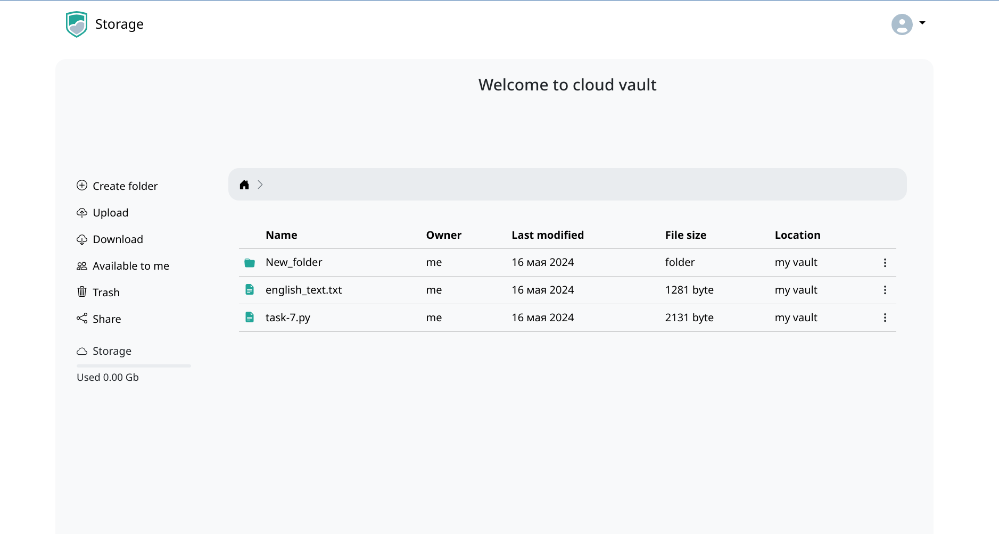
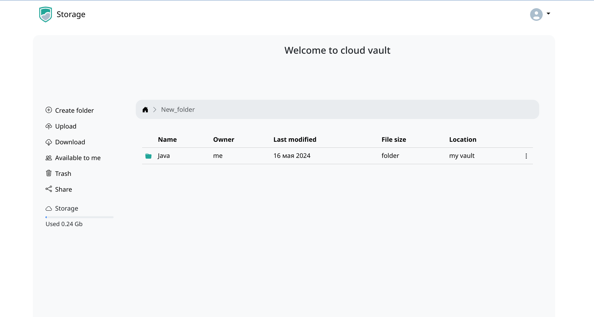
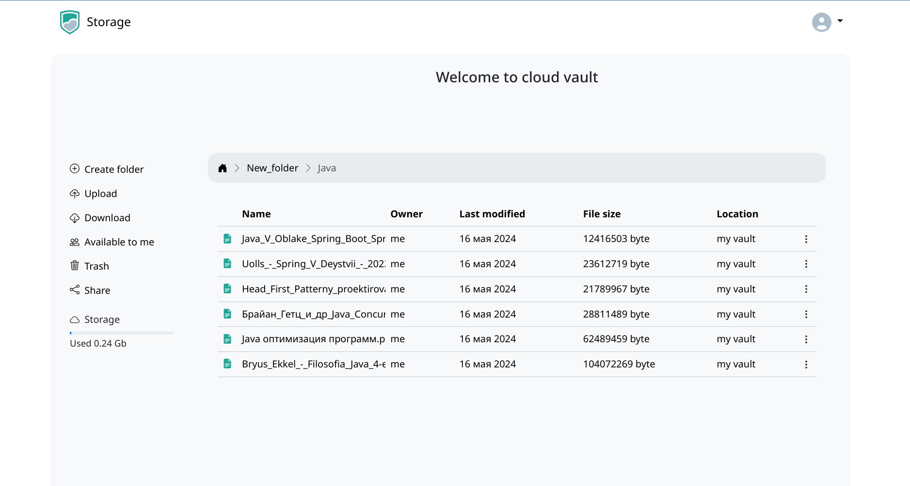
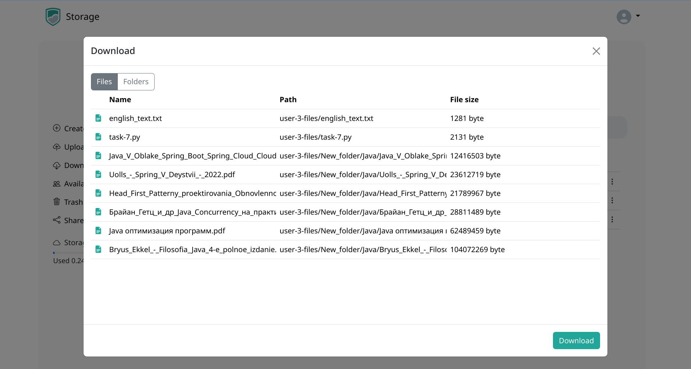
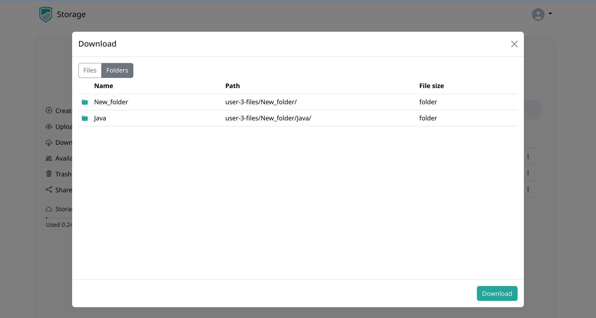
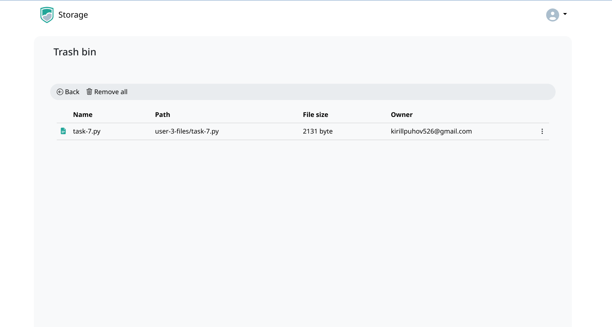

# Проект "облачное хранилище файлов"

Многопользовательское файловое облако. Пользователи сервиса могут использовать его для загрузки и хранения файлов. Источником вдохновения для проекта является Google Drive.

Автор идеи: https://github.com/zhukovsd

Авторское тз: https://zhukovsd.github.io/java-backend-learning-course/Projects/WeatherViewer/

## Стек

- Java 21
- Maven
- Backend
  - Spring Boot, Spring Security, Spring Sessions
  - Thymeleaf
- Данные
  - PostgreSQL
  - Spring Data JPA
  - Redis
  - Minio
- Frontend - HTML/CSS, Bootstrap
- Docker и Docker-Compose

## Функционал приложения

Работа с пользователями:

- Регистрация
- Авторизация
- Logout
- Удаление аккаунта

Работа с файлами и папками:

- Загрузка файлов и папок
- Создание новой пустой папки
- Перемещение в корзину
- Переименование
- Поделиться файлом

## Интерфейс приложения

## База данных

### Таблица `item`
| Название столбца | Тип данных     | Ограничения |
|------------------|----------------|-------------|
| id               | bigserial      | primary key |
| content_type     | varchar(255)   | not null    |
| item_size        | integer        | not null    |
| last_modified    | timestamp(6)   | not null    |
| name             | varchar(255)   |             |
| owner_email      | varchar(255)   | not null    |
| path             | varchar(255)   | unique      |

### Таблица `item_to_person`
| Название столбца | Тип данных | Ограничения           |
|------------------|------------|-----------------------|
| person_id        | bigint     | not null, foreign key |
| item_id          | bigint     | not null, foreign key |

### Таблица `person`
| Название столбца | Тип данных   | Ограничения        |
|------------------|--------------|--------------------|
| id               | bigserial    | primary key        |
| email            | varchar(255) | not null, unique   |
| first_name       | varchar(255) | not null           |
| last_name        | varchar(255) | not null           |
| password         | varchar(255) | not null           |
| phone            | varchar(255) | unique,            |

### Таблица `shared_item`
| Column Name  | Data Type  | Constraints |
|--------------|------------|-------------|
| id           | bigserial  | primary key |
| is_shared    | boolean    | not null    |
| item_id      | bigint     | unique,     |

